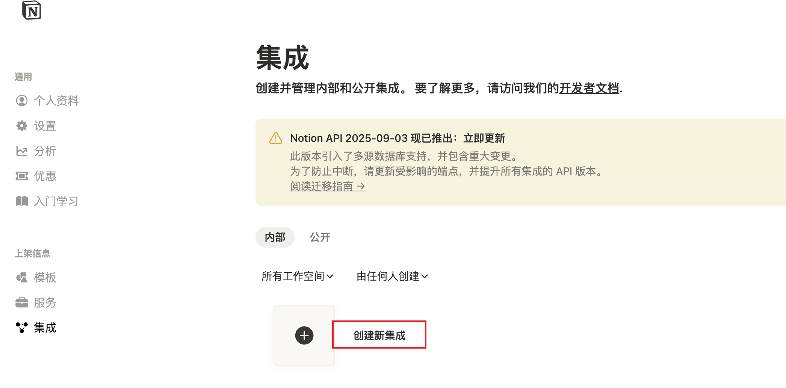
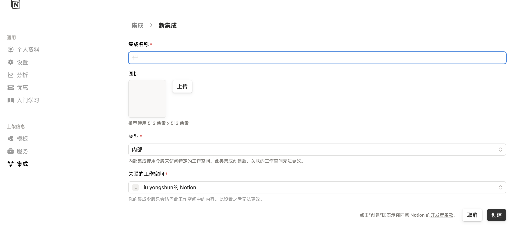
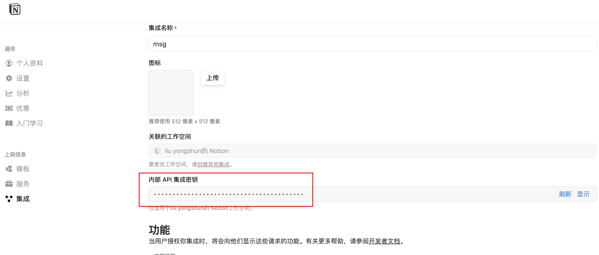
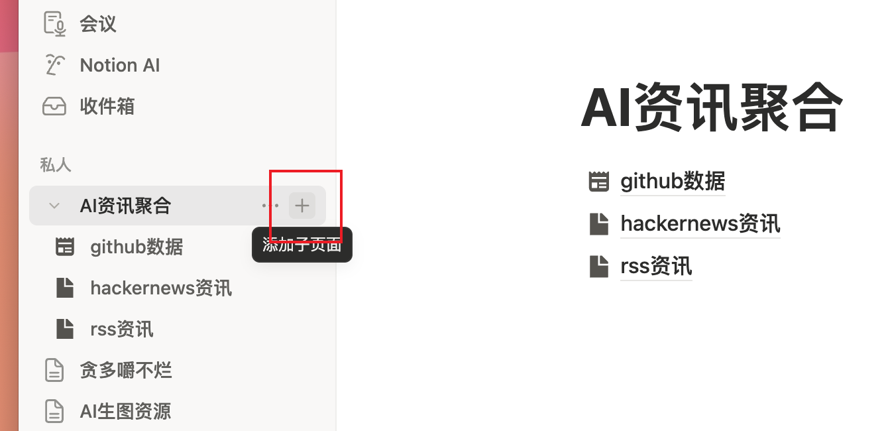
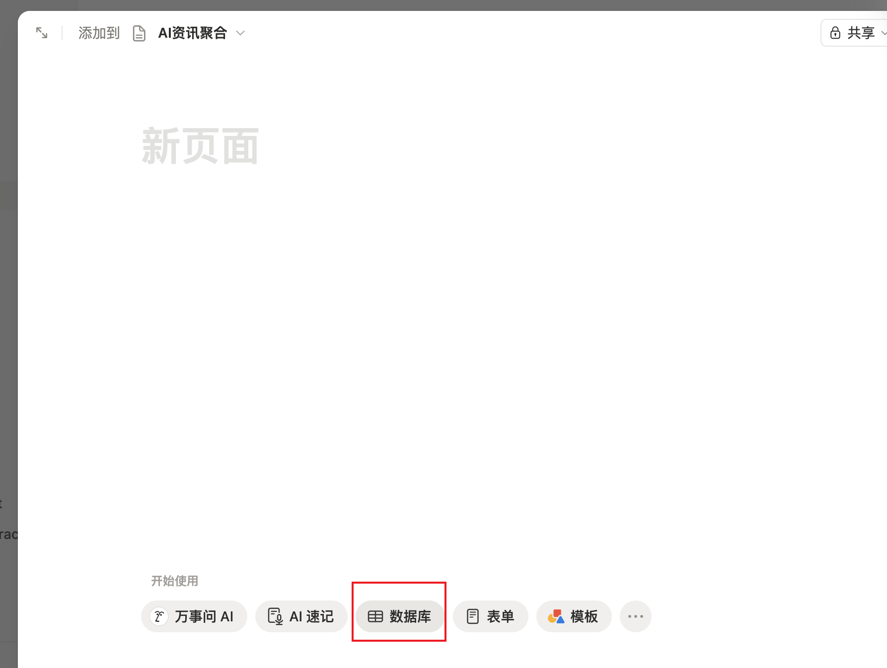
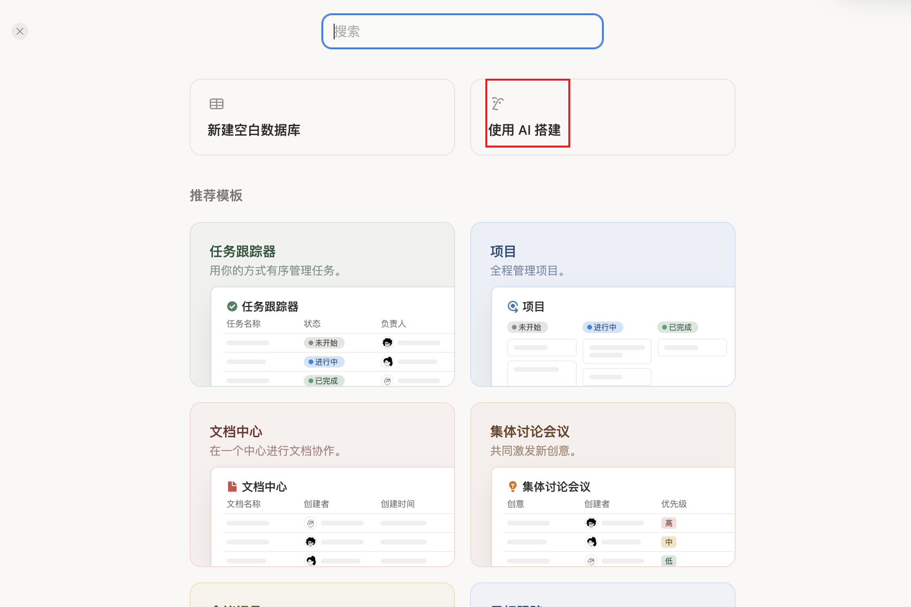
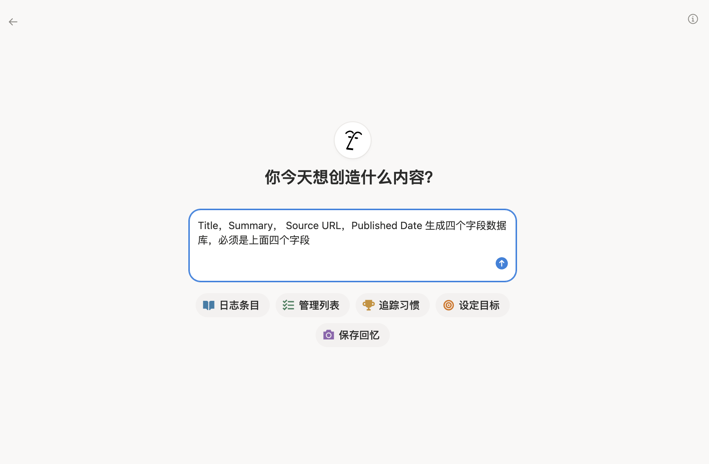
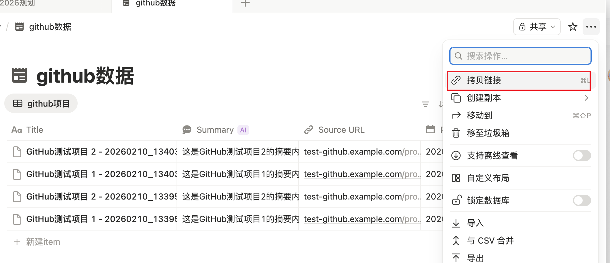

# Notion同步使用指南

## 功能说明

Notion同步功能可以将抓取生成的output数据自动同步到Notion数据库，方便随时查看和管理。

## 准备工作

### 1. 创建Notion集成

1. 访问 [Notion集成页面](https://www.notion.com/my-integrations)
2. 点击 "New integration" 创建新集成
3. 填写集成信息：
   - **Name**: 例如 "MsgSkill Sync"
   - **Associated workspace**: 选择你的工作区
4. 创建后，复制 **Internal Integration Token**（格式类似：`secret_xxx...`）





### 2. 创建Notion数据库

**推荐方案：为不同数据源创建独立的数据库**

为了更好的数据管理，建议为不同数据源创建独立的数据库：

1. **创建GitHub数据库**
   - 在Notion中创建新数据库，命名为 "GitHub项目" 或类似名称
   - 在数据库右上角点击 "..." → "Connections" → 选择你刚创建的集成
   - 复制数据库的分享链接，提取 **Database ID**

2. **创建RSS数据库**（可选）
   - 创建新数据库，命名为 "RSS文章" 或类似名称
   - 连接集成，获取 Database ID

3. **创建HackerNews数据库**（可选）
   - 创建新数据库，命名为 "HackerNews新闻" 或类似名称
   - 连接集成，获取 Database ID

4. **创建arXiv数据库**（可选）
   - 创建新数据库，命名为 "arXiv论文" 或类似名称
   - 连接集成，获取 Database ID

**Database ID提取方法**：
   - 链接格式：`https://www.notion.so/your-workspace/DATABASE_ID?v=...`
   - Database ID 是链接中 `notion.so/` 和 `?` 之间的部分（32位字符）

**注意**：如果某个数据源未配置数据库ID，系统会使用GitHub数据库作为默认数据库。







### 3. 配置数据库字段

建议在Notion数据库中创建以下字段（字段类型）：

| 字段名 | 类型 | 说明 | 必需 |
|--------|------|------|------|
| Title | Title | 文章标题 | ✅ |
| Summary | Rich text | 内容摘要 | |
| Source URL | URL | 来源链接 | |
| Published Date | Date | 发布日期 | |

### 4. 配置系统

编辑 `config/sources.json`，添加或修改 `notion_sync` 配置：

**多数据库配置（推荐）**：

```json
{
  "notion_sync": {
    "enabled": true,
    "api_token": "secret_你的Integration_Token",
    "description": "Notion同步配置 - 将output数据同步到Notion数据库",
    "auto_sync": {
      "github": false,                          // GitHub 自动同步开关
      "rss": false,                             // RSS 自动同步开关
      "hackernews": false,                      // HackerNews 自动同步开关
      "arxiv": false                            // arXiv 自动同步开关
    },
    "databases": {
      "github": {
        "database_id": "你的GitHub数据库ID",
        "description": "GitHub项目数据库"
      },
      "rss": {
        "database_id": "你的RSS数据库ID",
        "description": "RSS文章数据库（可选，为空则使用github数据库）"
      },
      "hackernews": {
        "database_id": "你的HackerNews数据库ID",
        "description": "HackerNews新闻数据库（可选，为空则使用github数据库）"
      },
      "arxiv": {
        "database_id": "你的arXiv数据库ID",
        "description": "arXiv论文数据库（可选，为空则使用github数据库）"
      }
    }
  }
}
```

**自动同步开关说明**（`auto_sync.*`）:
- **`true`**: 抓取完成后自动同步到 Notion（无需手动操作）
- **`false`**: 不自动同步，可通过预览页的「同步到 Notion」按钮手动选择单条同步
- 各数据源独立控制，可灵活配置哪些源自动同步、哪些手动同步

**单数据库配置（向后兼容）**：

如果只想使用一个数据库，可以只配置 `github` 数据库，其他数据源会自动使用该数据库：

```json
{
  "notion_sync": {
    "enabled": true,
    "api_token": "secret_你的Integration_Token",
    "databases": {
      "github": {
        "database_id": "你的数据库ID"
      }
    }
  }
}
```

## 使用方法

### 方式1：自动同步（推荐）

配置启用后，系统在保存output数据时会自动同步到Notion。

**优点**：
- 无需手动操作
- 实时同步
- 自动去重（基于Source URL）

**配置步骤**：
1. 在 `config/sources.json` 中设置 `notion_sync.enabled: true`
2. 设置对应数据源的 `auto_sync.*: true`（例如 `auto_sync.rss: true`）
3. 重启调度器，之后每次抓取完成后会自动同步

**示例配置**：
```json
{
  "notion_sync": {
    "enabled": true,
    "auto_sync": {
      "rss": true,           // RSS 自动同步
      "hackernews": false,   // HackerNews 手动同步
      "github": false,       // GitHub 手动同步
      "arxiv": false         // arXiv 手动同步
    }
  }
}
```

### 方式1.5：手动单条同步（预览页）

如果 `auto_sync.*` 设置为 `false`，可以通过预览页手动选择单条数据同步：

1. 访问预览页：`http://localhost:5001`
2. 选择数据源（RSS、HackerNews、GitHub、arXiv）
3. 点击任意条目右下角的「同步到 Notion」按钮
4. 查看屏幕中间的 Toast 提示（成功/失败）

### 方式2：手动同步脚本

使用独立的同步脚本，可以灵活控制同步时机：

```bash
# 同步今天的所有文件
python scripts/sync_to_notion.py

# 同步指定日期
python scripts/sync_to_notion.py --date 2026-02-10

# 同步指定文件
python scripts/sync_to_notion.py --file output/daily/2026-02-10/github_20260210_000031.json

# 同步所有日期的文件（谨慎使用）
python scripts/sync_to_notion.py --all
```

## 常见问题

### Q1: 同步失败，提示 "HTTP 401"

**原因**：API Token无效或已过期

**解决**：
1. 检查 `api_token` 是否正确
2. 重新创建集成并更新Token

### Q2: 同步失败，提示 "HTTP 404"

**原因**：Database ID错误或数据库未连接集成

**解决**：
1. 检查 `database_id` 是否正确
2. 确认数据库已连接集成（在数据库设置中检查）

### Q3: 同步失败，提示字段不存在

**原因**：Notion数据库中缺少某些字段

**解决**：
1. 在Notion数据库中创建缺失的字段
2. 或者修改 `notion_sync.py` 中的字段映射（可选字段会自动跳过）

### Q4: 如何禁用自动同步？

在 `config/sources.json` 中设置：
```json
{
  "notion_sync": {
    "enabled": false
  }
}
```

### Q5: 同步速度慢怎么办？

- Notion API有速率限制
- 大量数据建议分批同步
- 可以使用 `--date` 参数按日期分批同步

## 依赖安装

确保已安装 `httpx`：

```bash
pip install httpx
```

## 注意事项

1. **API Token安全**：不要将包含真实Token的配置文件提交到公开仓库
2. **速率限制**：Notion API有速率限制，大量同步时可能需要等待
3. **字段类型**：确保Notion数据库字段类型与代码中的映射一致
4. **去重机制**：基于Source URL去重，如果同一URL的内容有更新，需要手动删除旧页面

## 技术支持

如有问题，请查看：
- Notion API文档：https://developers.notion.com/
- 项目日志：查看同步过程的详细信息
